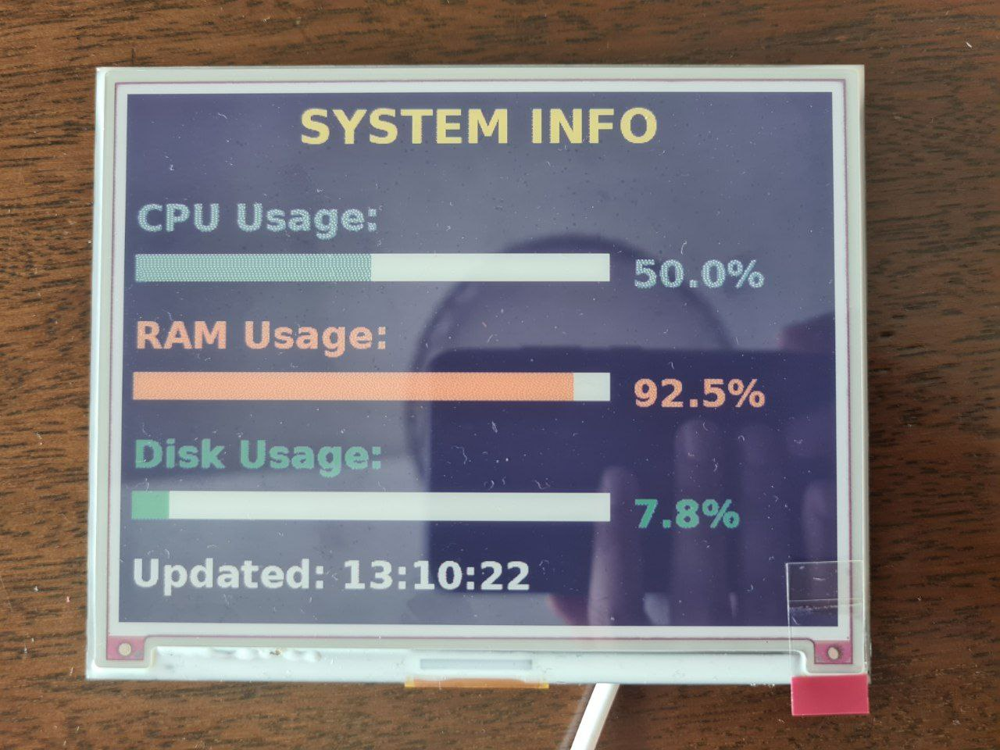
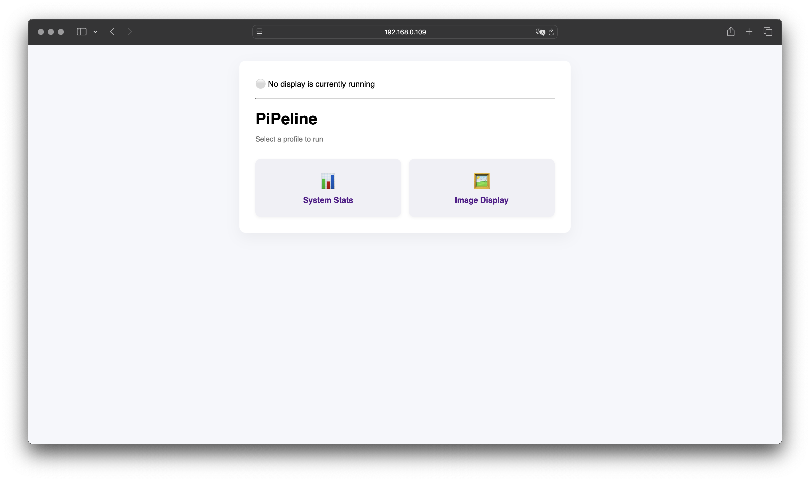
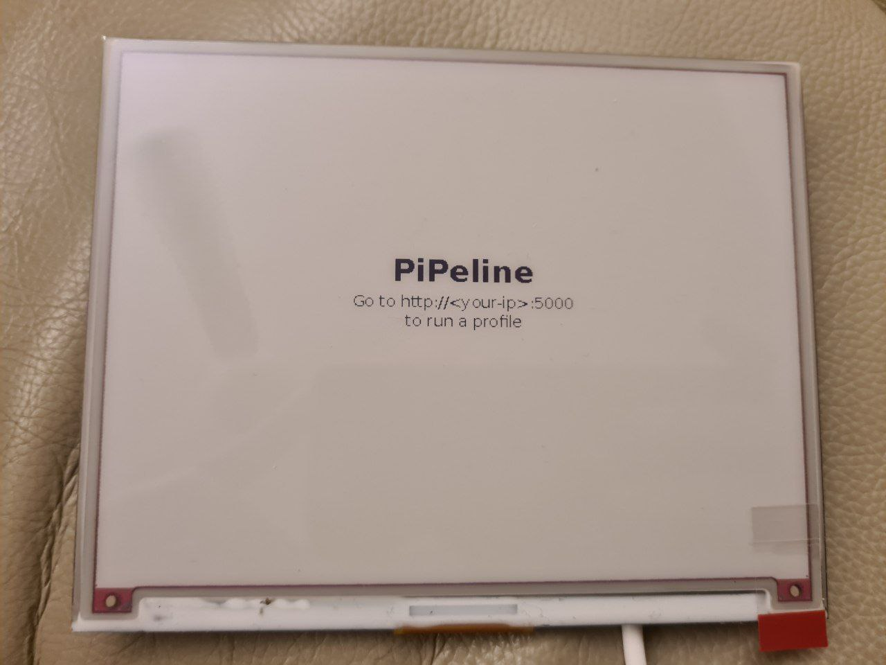
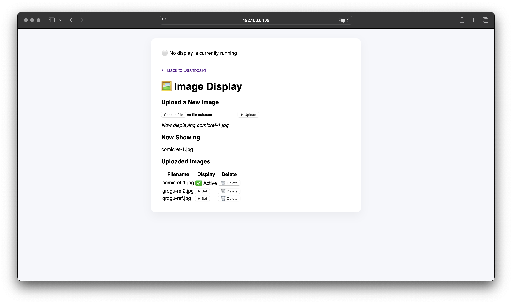

[](https://classroom.github.com/a/Tn7g_Mhz)

# Companion e-ink display

## Progress notes

1. Retrieves System stats (CPU, RAM and Disk) from a Mac and updates the display every 2 minutes.


2. Displays a chosen reference image.


3. Wrote a Flask web application. For now it has two profiles -- stats and images


4. When the web app is first run, the eink display automatically shows a splash screen



5. Stats

More needs to be added here but for now it just as a run/stop toggle


6. Image Display


TODO:

Web-app:
1. Polish UI
2. ~~Change main page buttons to navigate to profile-specific pages.~~
3. ~~Add a toggle button on profile pages to run or stop the associated script.~~
    - If stats script is running, image profile page should not show 'current image' as active
4. ~~Prevent duplicate processes by stopping any running script before starting a new one.~~
5. ~~Display a status card showing which script is currently running.~~
6. Issue: when GPIO pins are in use, the UI still shows the script as having run though nothing happens on the display
7. Ensure status card is updated when the script is first run

eink display:
1. Polish UI
2. (wishlist) dynamic UI for profiles so users can select what information they would like displayed from the web app
3. ~~Add intro page for when its initialised~~
    - see if its possible to set up a name url for the <your-ip>:5000 situation
4. TODO: check if mode "P" has a faster refresh rate than "RGB," in which case figure out how to use "P" for stats

tests:
1. ~~Add tests for app.py~~ (basic added)
2. Add tests for scripts
3. (wishlist) github actions

Packaging:
1. Write install script

## Set up notes

(Not polished yet; just adding it as I go along for now)

### 1. Flash Raspberry Pi OS and Configure

1. Download and open **Raspberry Pi Imager**.
2. Choose:
   - **OS**: Raspberry Pi OS (32-bit)
   - **Storage**: Select your SD card
3. Click the ⚙️ **Advanced Options**:
   - ✔️ Set hostname: `pi`
   - ✔️ Enable SSH (use password authentication)
   - ✔️ Username: `pi`
   - ✔️ Password: (set a password)
   - ✔️ Configure Wi-Fi:
     - SSID: (Type in the name of your wifi)
     - Password: (your Wi-Fi password)
     - Country: (your country)
4. Click **Write** to flash the SD card.

## 2. Manually Set Up Wi-Fi (If Needed)

If Wi-Fi does not connect on boot, do this:

1. Insert SD card into your Mac.
2. Open the **boot** partition (typically `/Volumes/bootfs` on macOS).
3. Create a file named `wpa_supplicant.conf`. For example:

   ```conf
   country=GB
   ctrl_interface=DIR=/var/run/wpa_supplicant GROUP=netdev
   update_config=1

   network={
       ssid="wifi_name"
       psk="your_wifi_password"
       key_mgmt=WPA-PSK
   }
   ```
4. Also create an empty file named `ssh` to enable SSH:
    ```
    touch /Volumes/bootfs/ssh
    ```
5. Eject the SD card and insert it into the Pi. Power it on.

## 3. Connect to the Pi

1. After ~1 min, SSH into the Pi:
    ```
    ssh pi@pi.local
    # or use IP from `arp -a` or your router
    ```
    Password: (what you set earlier)

### 4. Installing the Pimoroni Software (if needed)
More [here](https://learn.pimoroni.com/article/getting-started-with-inky-phat)

1. It's a great idea to start with a fresh install of Raspberry Pi OS or, if not, then make sure that you run `sudo apt update` and `sudo apt upgrade` in the terminal to get everything up-to-date.
2. Run the following commands in the terminal:
    ```
    git clone https://github.com/pimoroni/inky
    cd inky
    ./install.sh # prompts to create a venv
    ```
3. Once that's all done, type `sudo reboot` to reboot your Pi and apply the changes to the Pi's interfaces.
4. To enter the venev,
    ```
    source ~/.virtualenvs/pimoroni/bin/activate
    ```

### 5. Clone the Project Repo
1. Once logged in:
    ```
    git clone git@github.com:NCCA/pipeline-project-AnuKritiW.git # May need to configure ssh cloning on github
    cd pipeline-project-AnuKritiW/scripts
    chmod +x sendstats.sh # makes an executable
    ```

### 6. Run the Script
1. To test:
    ```
    ./sendstats.sh
    ```
    This should execute `stats.py`

## References
- https://learn.pimoroni.com/article/getting-started-with-inky-phat#displaying-text-on-inky-phat
- https://github.com/ryanwa18/spotipi-eink?tab=readme-ov-file
- https://www.youtube.com/watch?v=d9forDotXkI&ab_channel=DavidZhang
- https://github.com/fatihak/InkyPi
- https://roboticsbackend.com/raspberry-pi-create-a-flask-server/#Minimal_code_structure
- https://jinja.palletsprojects.com/en/stable/templates/
- GPT use
    - Generate initial HTML code blocks, which I then modified as needed
    - Brainstorm and refine UI wording
    - Understand Flask concepts more quickly
        - evaluating Flask vs FastAPI vs other options
        - Getting design recommendations for abstraction (e.g. Jinja inheritance)
    - Debugging
## Proposal (outdated)

This project aims to develop an E-Ink companion display that provides real-time, off-screen insights for users of Houdini or RenderMan. 

For Houdini, the display will show critical background information, such as memory usage, cache sizes, disk I/O, and live error tracking, helping users monitor system performance and identify bottlenecks while working. 

For RenderMan, the display will focus on render-specific metrics, including memory usage, disk I/O, and render performance details like texture memory usage and system bottlenecks. 

The device will offer a clean, always-on display that enhances workflow efficiency by surfacing important data not readily visible in the primary UI.

Here is a mockup:


