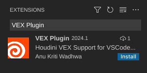
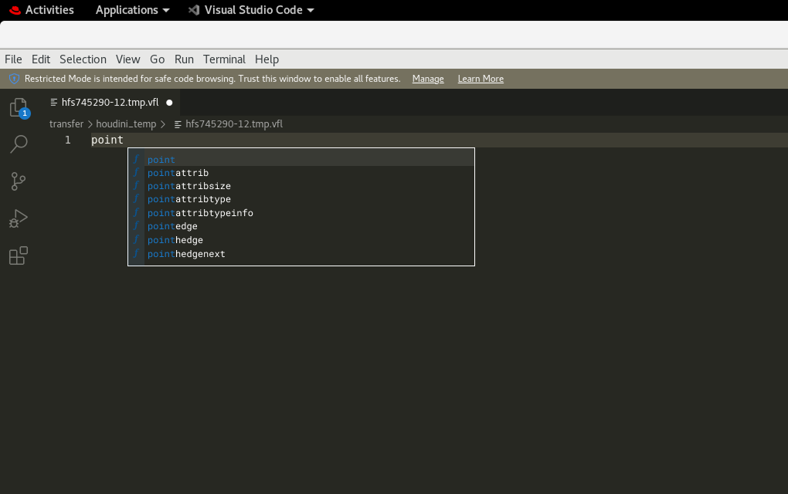
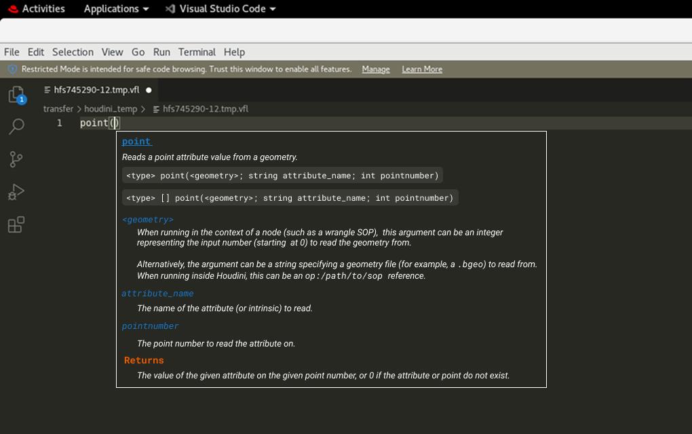
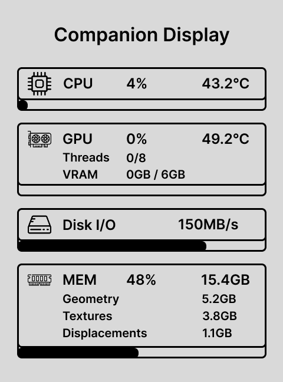
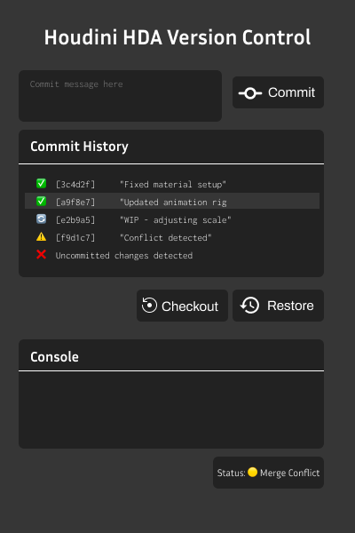

# Pipeline Project Ideas

## 1. VSCode plugin for VEX

A plugin that gives API suggestions as you type into vscode.
After deciding on the API, there is a parameter hint box that appears with the API description, argument help, etc.

Here is a mockup:

If there is time,a VIM plugin can be an extension to the project.

## 2. Companion e-ink display

This project aims to develop an E-Ink companion display that provides real-time, off-screen insights for users of Houdini or RenderMan. 

For Houdini, the display will show critical background information, such as memory usage, cache sizes, disk I/O, and live error tracking, helping users monitor system performance and identify bottlenecks while working. 

For RenderMan, the display will focus on render-specific metrics, including memory usage, disk I/O, and render performance details like texture memory usage and system bottlenecks. 

The device will offer a clean, always-on display that enhances workflow efficiency by surfacing important data not readily visible in the primary UI.

**I'm not sure if this would be useful as a pipeline tool. If it is, I would need to ask artists what statistics would be useful to display -- ideally some useful stats from Houdini directly.**

Here is a mockup:

## 3. Houdini HDA Version Control

Managing Houdini Digital Assets (HDAs) is challenging due to the lack of built-in version control. Using Git for HDA versioning doesn't work well because HDAs are binary files (.hda/.otl), making it difficult for Git to track differences and merge changes effectively.

This idea aims to implement a Git-like versioning system for HDAs, enabling automated tracking, commit history, and rollback functionality. By structuring HDAs into a Git-friendly format, artists and TDs can efficiently manage changes and revert to previous versions.

- Automate HDA version tracking using Git.
- Extract HDAs into a structured, text-based format for better diffing.
- Log commit history when an HDA is modified.
- Implement checkout and rollback functionality to restore previous versions.

### Possible Extension: UI Integration
To enhance usability, the project can be extended with a **Houdini Python Panel UI** using **PySide2 (Qt for Houdini)**. The UI would provide:
- **Commit, Rollback, and History buttons** for easy interaction.
- A **commit history panel** to browse previous versions.
- **Status indicators** for tracking uncommitted changes.

Here is a mockup:

#### Potential Tech Stack for UI:
- **PySide2/PyQt** for Houdini’s Qt-based UI.
- **GitPython** or `subprocess` for Git automation.
- **JSON or Houdini Metadata API** for storing commit information.
* Figma has a Qt Bridge so would try to figure that out too

## 4.  LEGO Asset Library & Asset Manager

Develop a LEGO asset browser and library for Maya or Houdini to streamline asset retrieval, reuse, and organization for LEGO animation projects. The tool will provide a searchable, categorized asset database with drag-and-drop insertion into DCCs, supporting various LEGO file formats.

- Centralized LEGO Asset Database
    - Organizes LEGO pieces by brick type, minifigs, vehicles, etc.
    - Allows tagging based on size, color, connection type, etc.

- Drag & Drop Asset Insertion would be nice

- LEGO Digital Designer (LDD) & Stud.io Compatibility
    - Supports importing/exporting .ldr, .io, .obj, .fbx, or .usd LEGO models.
    - Converts LEGO Digital Designer (LDD) and Stud.io models into a pipeline-ready format.

- Metadata & Versioning (Potential Extension)
    - Supports custom naming conventions for clean pipeline integration.
    - Tracks different versions of LEGO assets to prevent inconsistencies --> possible extension if there's time

- DCC Integration – Runs as a Python Panel inside Maya or Houdini.

#### Potential Tech Stack for UI:
- **Python** for core development
- **SQLite/JSON** for asset metadata storage
- **PySide2/PyQt** for UI
- **PIL** (Python Imaging Library) for generating asset thumbnails
- **PylDraw/BrickUtils** for LDD & Stud.io file parsing
- **Maya cmds/Houdini hou** for DCC integration