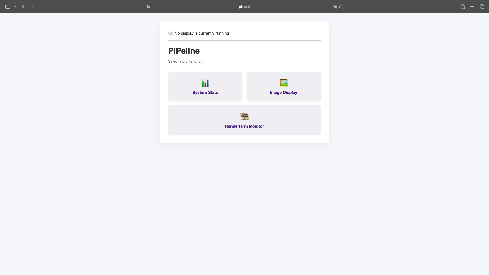
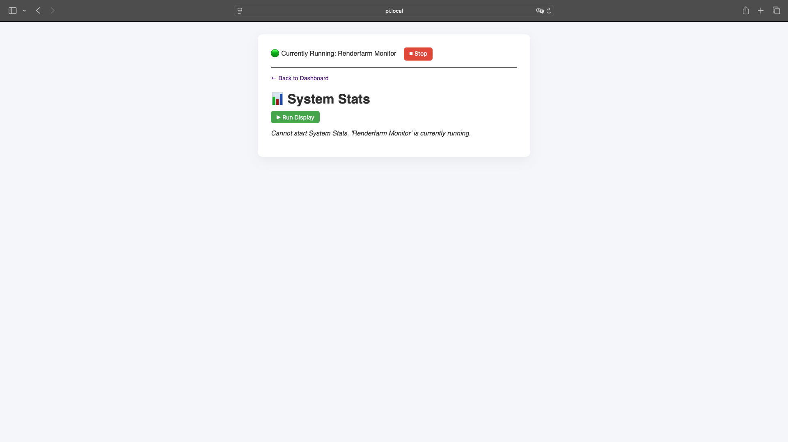
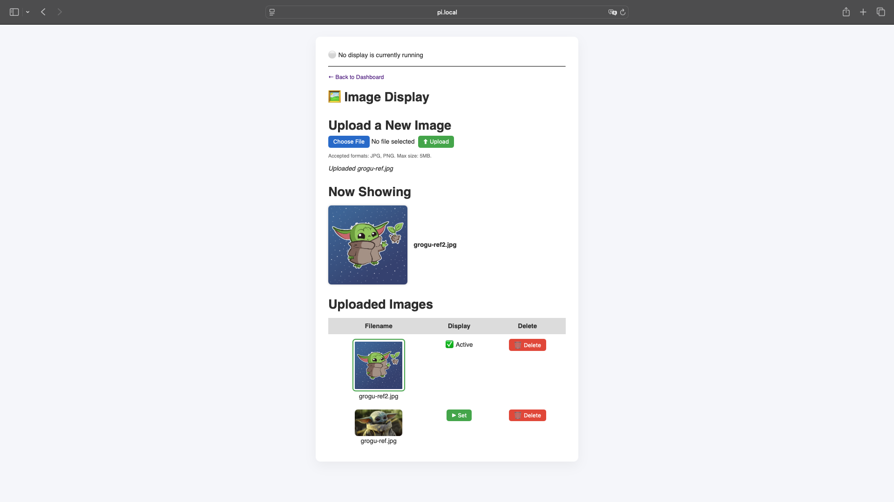
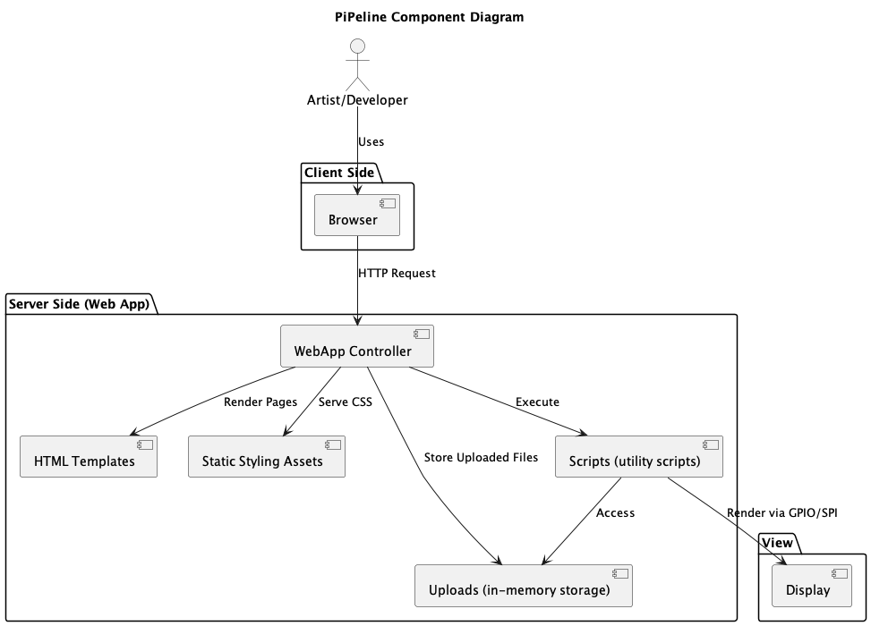
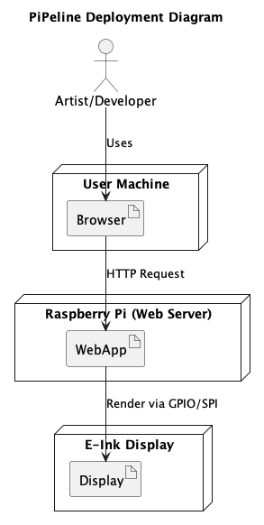
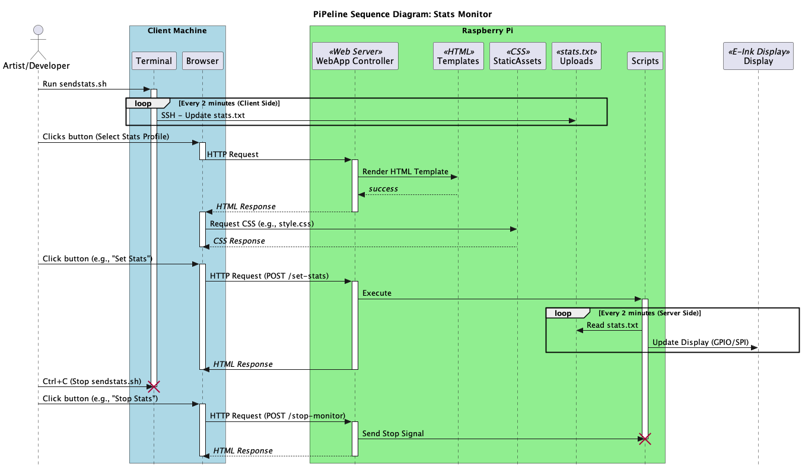

[](https://classroom.github.com/a/Tn7g_Mhz)

#### TODOs (as of 1/5):
- [ ] Testing/Github Actions to incorporate install scripts (?)
- [ ] Fix bug on image profile page -- profile page no longer redirecting correctly to a successful state though image loads on the pi
- [ ] Record Demo
- [ ] Include updated screenshots + images of pi
- [ ] Rename files (e.g. stats-test)
- [ ] Make file paths relative
- [ ] Clean up repository structure
<br><br>

# PiPeline - a companion e-ink display to assist artists

`PiPeline` is a lightweight, always-on companion display designed to support artists and technical directors during production workflows. It provides real-time system statistics to help quickly identify compute-heavy bottlenecks, alongside a customizable reference image display. By offering critical information and visual guidance at a glance, `PiPeline` enhances studio efficiency without disrupting the artist's main workspace.

The system is designed with flexibility in mind, allowing new profiles — such as render farm monitors or task-specific dashboards — to be easily added by pipeline engineers as production needs evolve.

> ## Table of Contents:
> - [Features](#features)
> - [Required Hardware](#required-hardware)
> - [Setting up the Pi](#setting-up-the-pi)
> - [Installation](#installation)
> - [Usage](#usage)
> - [Testing](#testing)
> - [Demo Images](#demo-images)
> - [UML Diagrams](#uml-diagrams)
> - [Branching and PRs](#branching-and-prs)
> - [References](#references)

## Features

* Real-time System Monitor
    * Displays live CPU, GPU, and memory usage from your developer machine, helping artists and TDs detect compute bottlenecks during rendering or heavy tasks.
* Reference Image Viewer
  *  Supports loading a reference image on the E-Ink display, useful for visual consistency or on-screen comparison while working.
*  Modular Profile System (Extensible)
   *  Designed with flexibility to support additional profiles — such as render farm status, task dashboards, or system alerts — with minimal configuration changes.
* Automated Setup Scripts
  * Includes install scripts (`install-mac.sh` and `install-pi.sh`) to streamline deployment.
* Web-Based Control Panel
  *  A lightweight Flask web app allows you to select the active display profile from any browser (currently tested with Safari).
* Headless Operation
   *  Set up over SSH without requiring a keyboard, mouse, or monitor for the Pi; SSH key authentication is supported.
* Test Suite with Continuous Integration
  *  Unit tests ensure reliability, with automatic execution via GitHub Actions.

## Required Hardware
In addition to your developer machine (this project is mac-compatible so far), you would need the following:
1. Raspberry Pi Zero 2 W
2. MicroSD Card (Minimum 8GB storage)
3. Raspberry Pi power adapter
4. E-Ink Display
    - Pimoroni Inky pHAT (or compatible Inky series display)
    - Connection: GPIO header (SPI)
5. (optional) Keyboard, Mouse, and Monitor if you prefer to do initial setup without SSH.

\** Both the pi and dev machine must be on the same network.

## Setting up the Pi

Before installing PiPeline, you need to prepare your Raspberry Pi by installing the operating system and enabling remote access.

### Flash Raspberry Pi OS
1. Download and install the [Raspberry Pi Imager](https://www.raspberrypi.com/software/).
2. Insert your MicroSD card into your computer.
3. In the Imager:
    Choose OS: Raspberry Pi OS (64-bit), or whatever is recommended
    Choose Storage: Select your MicroSD card
4. After clicking `Next`, click `Edit Settings`.
    * Set hostname (e.g. pi)
    * Set username and password
    * Configure Wi-Fi (SSID, password, country)
    * Enable SSH
5. Click Write to flash the SD card.

### Insert and Boot
1. Insert the flashed MicroSD card into the Raspberry Pi.
2. Connect the E-Ink display to the GPIO header.
3. Power on the Pi.

### Connect to the Pi via SSH
After the Pi boots (~1 minute), connect from your computer:
```
ssh pi@pi.local
```
If `pi.local` doesn't work, find the Pi's IP address using your router settings or a tool like `arp -a`.

### (Optional) Set Up SSH Key Authentication
To avoid typing your password every time you connect:
1. Check if you have an SSH key:
```
ls ~/.ssh/id_ed25519.pub
```
2. If you don't have one, generate it:
```
ssh-keygen -t ed25519 -C "your_email@example.com"
```
3. Copy the key to the Pi:
```
ssh-copy-id pi@pi.local
```
After this, you should be able to SSH into your Pi without typing your password each time.

### (Optional) Set Up SSH Key Authentication for Github
On the pi,
1. Check if you have an SSH key:
```
ls -al ~/.ssh
```
2. If you don't have one, generate it:
```
ssh-keygen -t ed25519 -C "git access for pi"
```
3. Copy the key:
```
cat ~/.ssh/id_ed25519.pub
```
4. [Set up a new key on Github](https://github.com/settings/ssh/new):


## Installation

<!-- 1. Enable SPI and I2C under "Interface Options" with the command:
```
sudo raspi-config
``` -->
<!-- TODO: The steps below use installation scripts. If you prefer setting things up manually, see [Manual Setup Instructions](./assets/docs/manual-setup.md). -->

### On Developer Machine

1. On your Mac, clone the project and run the install script
(To get stats, scripts would have to be run from your Mac)
```
git clone git@github.com:NCCA/pipeline-project-AnuKritiW.git
cd pipeline-project-AnuKritiW
chmod +x install/install-mac.sh
./install/install-mac.sh
```

### On the Pi

1. Clone the project and run the install script:
```
git clone git@github.com:NCCA/pipeline-project-AnuKritiW.git
cd pipeline-project-AnuKritiW
chmod +x install-pi.sh
./install-pi.sh
```

2. (If needed) Reboot the pi
```
sudo reboot
```

## Usage

### On Developer Machine

1. To send pc stats to the pi
```
source venv/bin/activate
chmod +x scripts/sendstats.sh
./scripts/sendstats.sh
```

This script is a continuously running script that will send CPU usage, GPU usage and Memory usage to the pi every 2 minutes.

### On the Pi

1. On Safari, visit `http://pi.local:5000`
TODO: (On other browsers, some settings need to be changed to access)

2. Choose the profile you would like to load up on the pi

\* Some useful systemd commands
```
sudo systemctl stop pipeline-project.service    # to stop running
sudo systemctl status pipeline-project.service  # confirm it has stopped running
sudo systemctl start pipeline-project.service   # to start running
sudo systemctl disable pipeline-project.service # Disable auto start on boot
```

## Testing

### Run the complete test suite
```
cd pipeline-project-AnuKritiW
source ~/.virtualenvs/pimoroni/bin/activate
pytest tests/
```

### Test coverage
```
cd pipeline-project-AnuKritiW
source ~/.virtualenvs/pimoroni/bin/activate
pytest --cov=web_app tests/
```

### Continuous Integration with GitHub Actions
All unit tests located in the tests/ directory are run automatically on each push and pull request.
<!-- TODO: CI workflow ensures that installation scripts and project dependencies remain valid across updates -->
The workflow file is located at:
```
.github/workflows/tests.yml
```

## Demo Images

| Feature Description                                                                            | Demo Image                                                                              |
| ---------------------------------------------------------------------------------------------- | --------------------------------------------------------------------------------------- |
| Wrote a Flask web application. It has two profiles -- stats and images.                        |                           |
| When the web app is first run, the eink display automatically shows a splash screen.           |          |
| Stats profile view in web app.                                                                 |                 |
| Retrieves System stats (CPU, RAM and Disk) from a Mac and updates the display every 2 minutes. |              |
| Image Display profile view in web app.                                                         |                 |
| Displays a chosen reference image.                                                             |  |

## UML Diagrams

### Component Diagram



### Deployment Diagram



### Sequence Diagram



## Branching and PRs

Feature branches and bug-fix branches were used consistently to ensure the `main` branch remained stable and production-ready.

* **Feature Branches**: Each feature/functionality, such as the initial application build, test suite development, and CI integration, was developed on a separate branch to isolate changes.
* **Pull Requests (PRs)**: All changes were merged into the main branch through well-documented PRs. Each PR included a detailed description of the changes, making it easy to trace the purpose of merge commits.
    * PR history can be found [here](https://github.com/NCCA/pipeline-project-AnuKritiW/pulls?q=is%3Apr+is%3Aclosed)
* **Commit History**: The commit history consists of small, meaningful commits that clearly document the development process. Since this is an assignment submission, features and bug fixes were not squashed before merging to preserve a transparent record of interactions with the repository.

## References

* Ak, F., 2025. *InkyPi*. Github. Available from: https://github.com/fatihak/InkyPi [Accessed 10 February 2025].
* Ak, F., 2024. *Minimal E-Ink Clock with a Raspberry Pi (Tutorial)* [video]. YouTube. Available from: https://www.youtube.com/watch?v=L5PvQj1vfC4&ab_channel=AKZDev [Accessed 10 February 2025].
* Pallets, 2024. *Template Designer Documentation*. Available from: https://jinja.palletsprojects.com/en/stable/templates/ [Accessed 21 April 2025].
* Pimoroni, 2024. *Getting Started with Inky pHAT*. Available from: https://learn.pimoroni.com/article/getting-started-with-inky-phat#displaying-text-on-inky-phat [Accessed 15 March 2025].
* The Robotics Back-End, 2024. *Raspberry Pi – Create a Flask Server*. Available from: https://roboticsbackend.com/raspberry-pi-create-a-flask-server/ [Accessed 16 April 2025].
* Ward, R., 2023. *spotipi-eink*. Github. Available from: https://github.com/ryanwa18/spotipi-eink?tab=readme-ov-file [Accessed 10 February 2025].
* Zhang, D., 2024. *The E-ink Desk Accessory I've Always Wanted.* [video]. YouTube. Available from: https://www.youtube.com/watch?v=d9forDotXkI&ab_channel=DavidZhang [Accessed 10 February 2025].

ChatGPT was used for
* Generating initial HTML code templates, which were subsequently modified and adapted to project needs.
* Brainstorming and refining UI wording.
* Understanding Flask concepts more quickly, including:
    * Evaluating Flask, FastAPI, and other backend frameworks to select the most suitable option.
    * Getting design recommendations for abstraction (e.g. Jinja template inheritance)
* Debugging and troubleshooting issues during development.
* All suggestions provided by ChatGPT were critically reviewed and adapted as necessary to ensure correctness and alignment with the project requirements.